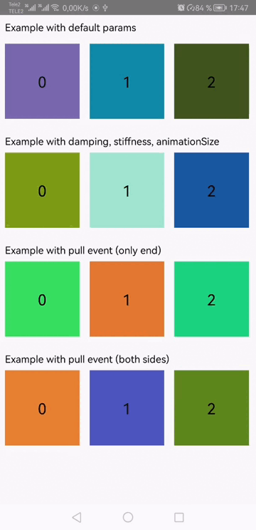

# Extra bouncy

Add IOS-like overscroll animation to your scrolling views

The library was taken as the basis https://github.com/valkriaine/Bouncy
Extra bouncy сorrects algorithmic errors and visual bugs and adds new features.

# Preview



# How to use

Simple use with default effects
```
<com.alab.extra_bouncy.BouncyRecyclerView
        android:id="@+id/rv"
        android:layout_width="match_parent"
        android:layout_height="wrap_content"
        android:orientation="horizontal"
        app:layoutManager="androidx.recyclerview.widget.LinearLayoutManager" />
```

With damping, stiffness, animationSize
```
<com.alab.extra_bouncy.BouncyRecyclerView
        android:id="@+id/rv"
        android:layout_width="match_parent"
        android:layout_height="wrap_content"
        android:orientation="horizontal"
        app:bouncyRecyclerviewDampingRatio="DAMPING_RATIO_HIGH_BOUNCY"
        app:bouncyRecyclerviewStiffness="STIFFNESS_HIGH"
        app:layoutManager="androidx.recyclerview.widget.LinearLayoutManager"
        app:recyclerviewOverscrollEndAnimationSize="1"
        app:recyclerviewOverscrollStartAnimationSize="1" />
```

With pull event (both sides). Download an example to understand how to use it
```
<androidx.constraintlayout.widget.ConstraintLayout
        android:layout_width="match_parent"
        android:layout_height="wrap_content"
        android:orientation="horizontal">

        <com.alab.extra_bouncy.BouncyRecyclerView
            android:id="@+id/rv"
            android:layout_width="match_parent"
            android:layout_height="wrap_content"
            android:orientation="horizontal"
            app:bouncyRecyclerviewOverscrollMode="OVERSCROLL_ALL"
            app:layoutManager="androidx.recyclerview.widget.LinearLayoutManager"
            app:layout_constraintBottom_toBottomOf="parent"
            app:layout_constraintEnd_toEndOf="parent"
            app:layout_constraintStart_toStartOf="parent"
            app:layout_constraintTop_toTopOf="parent"
            app:recyclerviewOverscrollEndAnimationSize="1"
            app:recyclerviewOverscrollStartAnimationSize="1" />

        <ImageView
            android:id="@+id/iv_start"
            android:layout_width="80dp"
            android:layout_height="80dp"
            android:layout_centerVertical="true"
            android:alpha="0"
            android:padding="8dp"
            android:rotation="180"
            android:src="@drawable/ic_expand"
            app:layout_constraintBottom_toBottomOf="parent"
            app:layout_constraintEnd_toStartOf="@id/rv_4"
            app:layout_constraintTop_toTopOf="parent"
            tools:ignore="ContentDescription" />

        <ImageView
            android:id="@+id/iv_end"
            android:layout_width="80dp"
            android:layout_height="80dp"
            android:layout_centerVertical="true"
            android:alpha="0"
            android:padding="8dp"
            android:src="@drawable/ic_expand"
            app:layout_constraintBottom_toBottomOf="parent"
            app:layout_constraintStart_toEndOf="@id/rv_4"
            app:layout_constraintTop_toTopOf="parent"
            tools:ignore="ContentDescription" />

    </androidx.constraintlayout.widget.ConstraintLayout>
```


# To get a Git project into your build:
Add it in your root build.gradle at the end of repositories
```
allprojects {
	repositories {
		...
		maven { url 'https://jitpack.io' }
	}
}
```
```
dependencies {
	implementation 'com.github.AndroidLab:ExtraBouncy:Tag'
}
```
